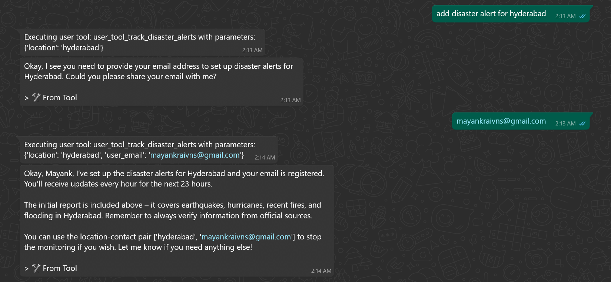
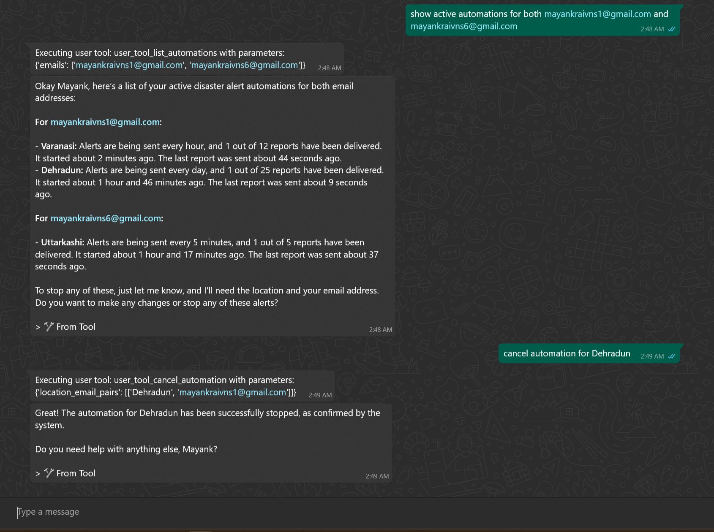

# AutoMCP: Disaster Alert Automation for Puch AI

## Overview

AutoMCP transforms Puch AI from reactive to proactive with automated disaster monitoring. Instead of waiting for queries, it continuously scans emergency news, sends email alerts, and tracks critical events like floods and earthquakes across multiple locations simultaneously.

## Key Features

- **Real-time Disaster Tracking** - Monitors floods, earthquakes, and emergencies for any location
- **Automated Email Alerts** - Sends detailed reports with severity scores and trusted news sources
- **Multi-location Monitoring** - Track multiple locations with different email recipients concurrently  
- **Flexible Configuration** - Customizable update frequency and monitoring duration
- **Beyond Disasters** - Extensible for sports scores, price tracking, system monitoring


*AutoMCP adding disaster alerts*


*Active email alert for ongoing disaster monitoring*

## Core Tools

| Tool | Purpose |
|------|---------|
| `track_disaster_alerts` | Start monitoring with location, email, and intervals |
| `cancel_automation` | Stop monitoring using location-email pairs |
| `list_automations` | View active monitors and their status |

## Quick Setup

```bash
# Clone repository
git clone https://github.com/Mayankrai449/AutoMCP
cd AutoMCP

# Setup environment
python -m venv venv
source venv/bin/activate  # Windows: venv\Scripts\activate
pip install -r requirements.txt

# Configure environment variables
cp .env.example .env
# Edit .env with your actual credentials

# Start server
python main.py
```


## Dependencies

```
beautifulsoup4>=4.13.4,
dotenv>=0.9.9,
fastmcp>=2.11.2,
markdownify>=1.1.0,
pillow>=11.3.0,
python-dotenv>=1.1.1,
readabilipy>=0.3.0,
duckduckgo_search>=8.1.1,
ddg>=0.2.2,
ddgs>=9.5.2
```

## Usage Examples

**Start Monitoring:**
```
"Monitor Delhi every 30 minutes at user@example.com for 2 days"
```

**Check Status:**
```
"List all active disaster monitors"
```

**Cancel Monitoring:**
```
"Stop monitoring Delhi for user@example.com"
```

## Why AutoMCP?

Converts Puch AI into a proactive disaster response system, keeping users informed about critical events before they escalate. Essential for disaster-prone areas and emergency preparedness.

---

**Contact:** mayankraivns@gmail.com